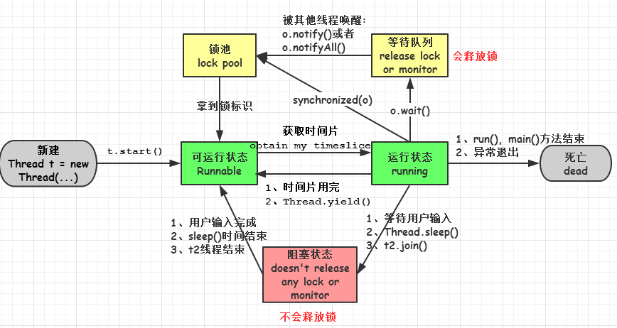
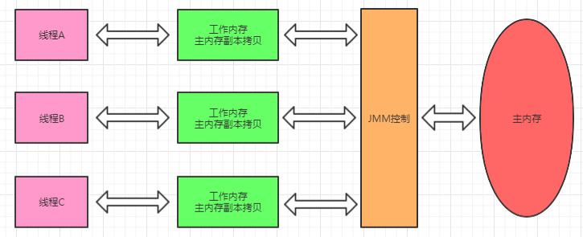
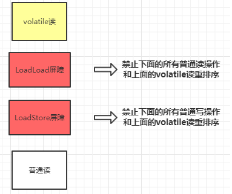
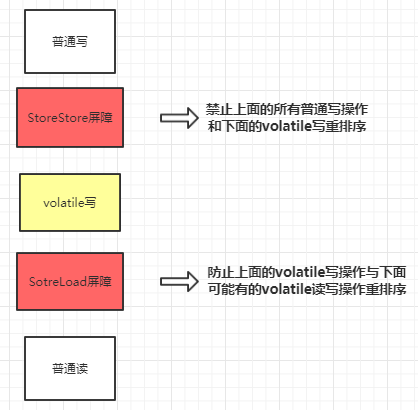
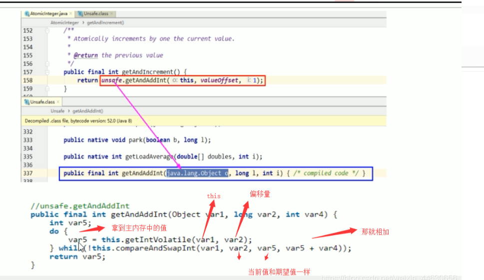
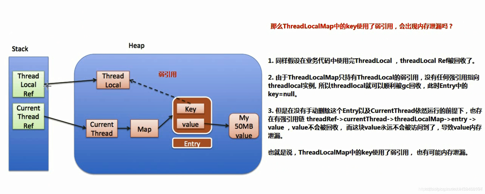
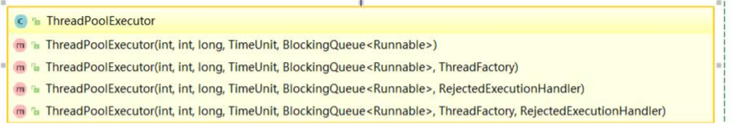
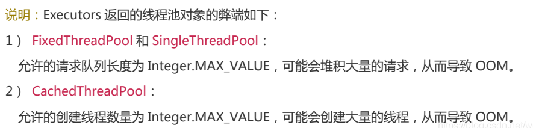

# 锁相关问题

**什么是死锁？**

* 死锁是指两个或多个以上的线程在执行过程中，占有资源，并因争夺资源而造成一种**互相等待**的现象，若无外力干涉那他们都将无法推进下去。


**形成死锁的四个必要条件是什么?**

* **互斥条件**：线程(进程)对于所分配到的资源具有排它性，即一个资源只能被一个线程(进程)占用，直到被该线程(进程)释放
* **请求与保持条件**：一个线程(进程)因请求被占用资源而发生阻塞时，对已获得的资源保持不放。
* **不剥夺条件**：线程(进程)已获得的资源在末使用完之前不能被其他线程强行剥夺，只有自己使用完毕后才释放资源。
* **循环等待条件**：当发生死锁时，所等待的线程(进程)必定会形成一个环路（类似于死循环），造成永久阻塞


**如何预防线程死锁?**

* **破坏互斥条件**

  这个条件很多时候没有办法破坏，因为我们用锁本来就是想让他们互斥的（临界资源需要互斥访问）。当然也可以把某些独占设备在逻辑上改成共享设备。

* **破坏请求与保持条件**

  一次性申请所有的资源。

* **破坏不剥夺条件**

  方法一：占用部分资源的线程进一步申请其他资源时，如果申请不到，可以主动释放它占有的资源。

  方法二：采用剥夺式的调度算法

* **破坏循环等待条件**

  * 可采用顺序资源分配法。首先给系统中的资源编号，规定每个进程必须按编号递增的顺序请求资源，同类资源（即编号相同的资源）一次申请完。
  * 原理分析：一个进程只有已占有小编号的资源时，才有资格申请更大编号的资源。按此规则，已持有大编号资源的进程不可能逆向地回来申请小编号的资源，从而就不会产生循环等待的现象。

**避免死锁？**


**如何排查死锁?**

1. **jps**命令定位进程号
2. **jstack**找到死锁查看


# 线程相关面试题

## 创建线程的方式

1. 创建**继承于Thread类**的子类，并重写Thread类的run()方法
2. 创建一个**实现了Runnable接口**的类，并实现run()方法

3. 通过**Callable和Future创建线程**
   1. 创建一个实现Callable的实现类，并实现call方法
   2. 将Callable接口实现类的对象作为传递到FutureTask构造器中，创建FutureTask的对象
   3. 将FutureTask的对象作为参数传递到Thread类的构造器中，创建Thread对象，并调用start()
   4.  调用FutureTask对象的get()方法来获得子线程执行结束后的返回值 
4. 使用Executors工具类创建**线程池**


## runnable 和 callable 有什么区别？

* 相同点
  * 都是接口
  * 都可以编写多线程程序
  * 都采用Thread.start()启动线程

* 主要区别
  * Runnable 接口 **run 方法无返回值**；Callable 接口 **call 方法有返回值**，支持泛型，和Future、FutureTask配合可以用来获取异步执行的结果
  * Runnable 接口 run 方法只能抛出运行时异常，且无法捕获处理；Callable 接口 call 方法**允许抛出异常，可以获取异常信息**
    注：Callalbe接口支持返回执行结果，需要调用FutureTask.get()得到，此方法会阻塞主进程的继续往下执行，如果不调用不会阻塞。


## 线程的 run()和 start()有什么区别？

* start() 方法用于启动线程，run() 方法用于执行线程的运行时代码。run() 可以重复调用，而 start() 只能调用一次。  多次调用会抛出 java.lang.IllegalThreadStateException 异常 

* new 一个 Thread，线程进入了新建状态。调用 **start() 方法**，会**启动一个线程并使线程进入了就绪状态**，当分配到时间片后就可以开始运行了。 start() 会执行线程的相应准备工作，然后自动执行 run() 方法的内容，这是真正的多线程工作。

* 而直接执行 run() 方法，会把 run 方法当成一个 **main 线程下的普通方法**去执行，并不会在某个线程中执行它，所以这并不是多线程工作。

## 线程的生命周期




1. **新建(new)**：新创建了一个线程对象。

2. **就绪(runnable)**：线程对象创建后，当调用线程对象的 start()方法，该线程处于就绪状态，等待被线程调度选中，获取cpu的使用权。

3. **运行(running)**：可运行状态(runnable)的线程获得了cpu时间片（timeslice），执行程序代码。注：就绪状态是进入到运行状态的唯一入口，也就是说，线程要想进入运行状态执行，首先必须处于就绪状态中；

4. **阻塞(block)**：处于运行状态中的线程由于某种原因，暂时放弃对 CPU的使用权，停止执行，此时进入阻塞状态，直到其进入到就绪状态，才 有机会再次被 CPU 调用以进入到运行状态。

   阻塞的情况分三种：

   1. 等待阻塞：运行状态中的线程执行 wait()方法，JVM会把该线程放入等待队列(waitting queue)中，使本线程进入到等待阻塞状态；
   2. 同步阻塞：线程在获取 synchronized 同步锁失败(因为锁被其它线程所占用)，，则JVM会把该线程放入锁池(lock pool)中，线程会进入同步阻塞状态；
   3. 其他阻塞: 通过调用线程的 sleep()或 join()或发出了 I/O 请求时，线程会进入到阻塞状态。当 sleep()状态超时、join()等待线程终止或者超时、或者 I/O 处理完毕时，线程重新转入就绪状态。

5. **死亡(dead)**：线程run()、main()方法执行结束，或者因异常退出了run()方法，则该线程结束生命周期。死亡的线程不可再次复生。


## sleep() 和 wait() 有什么区别？
相同点：

* 一旦执行方法，都可以使得当前的线程进入阻塞状态。

不同点：

* 两个方法声明的位置不同：sleep() 是 Thread线程类的静态方法，wait() 是 Object类的方法。
* 是否释放锁：如果两个方法都使用在同步代码块或同步方法中，sleep() 不释放锁；wait() 释放锁。
* 用途不同：Wait 通常被用于线程间交互/通信，sleep 通常被用于暂停执行。
* 用法不同：wait() 方法被调用后，线程不会自动苏醒，需要别的线程调用同一个对象上的 notify() 或者 notifyAll() 方法。sleep() 方法执行完成后，线程会自动苏醒。或者可以使用wait(long timeout)超时后线程会自动苏醒。
* 调用的要求不同：sleep()可以在任何需要的场景下调用。 wait()必须使用在同步代码块或同步方法中


**wait()使用注意：防止出现虚假唤醒机制**

当对共享变量进行判断的时候，为了防止出现虚假唤醒机制，不能使用if来进行判断，而应该使用**while**。因为当线程被唤醒时候必须再进行一次判断。

```java
// 判断条件是否得到满足
while(number != 0) {
    // 等待不能生产
    condition.await();//当线程从阻塞状态被唤醒的时候必须再进行判断
}
```


# synchronized关键字（需要系统学习）

**synchronized的使用？**

synchronized关键字最主要的三种使用方式：**修饰实例方法:、修饰静态方法、修饰代码块。**

- **对于普通同步方法，锁是当前实例对象。**
- **对于静态同步方法，锁是当前类的Class对象。**
- **对于同步代码块，锁是synchronized括号里配置的对象。**


## synchronized 和 volatile 的区别是什么？

* volatile 是变量修饰符；synchronized 可以修饰类、方法、变量。

* volatile 仅能实现变量的修改可见性，不能保证原子性；而 synchronized 则可以保证变量的修改可见性和原子性。

* volatile 不会造成线程的阻塞；synchronized 可能会造成线程的阻塞。

* volatile标记的变量不会被编译器优化；synchronized标记的变量可以被编译器优化。

* volatile关键字是线程同步的轻量级实现，主要用于解决变量在多个线程之间的可见性，而 synchronized 关键字解决的是多个线程之间访问资源的同步性。


## synchronized底层原理

**synchronized`代码块`底层原理：**

 从字节码中可知 **`synchronized` 同步语句块的实现使用的是 `monitorenter` 和 `monitorexit` 指令，其中 `monitorenter` 指令指向同步代码块的开始位置，`monitorexit` 指令则指明同步代码块的结束位置。**

当执行 `monitorenter` 指令时，线程试图获取锁也就是获取 **对象监视器 `monitor`** 的持有权。

在执行`monitorenter`时，会尝试获取对象的锁，如果锁的计数器为 0 则表示锁可以被获取，获取后将锁计数器设为 1 也就是加 1。

在执行 `monitorexit` 指令后，将锁计数器设为 0，表明锁被释放。如果获取对象锁失败，那当前线程就要阻塞等待，直到锁被另外一个线程释放为止。


**synchronized`方法`底层原理：**

 `synchronized` 修饰的方法并没有 `monitorenter` 指令和 `monitorexit` 指令，取得代之的确实是 `ACC_SYNCHRONIZED` 标识，该标识指明了该方法是一个同步方法。JVM 通过该 `ACC_SYNCHRONIZED` 访问标志来辨别一个方法是否声明为同步方法，从而执行相应的同步调用 


## synchronized的锁升级

| 锁       | 优点                                                         | 缺点                                             | 适用场景                                                     |
| -------- | ------------------------------------------------------------ | ------------------------------------------------ | ------------------------------------------------------------ |
| 偏向锁   | 加锁和解锁不需要额外的消耗，和执行非同步方法比仅存在纳秒级的差距。 | 如果线程间存在锁竞争，会带来额外的锁撤销的消耗。 | 适用于基本没有线程竞争锁的同步场景。                         |
| 轻量级锁 | 竞争的线程不会阻塞，提高了程序的响应速度。                   | 如果始终得不到锁竞争的线程使用自旋会消耗CPU。    | 适用于少量线程竞争锁对象，且线程持有锁的时间不长，追求响应速度的场景。 |
| 重量级锁 | 线程竞争不使用自旋，不会消耗CPU。                            | 线程阻塞，响应时间缓慢。                         | 很多线程竞争锁，同步块执行时间较长。追求吞吐量的场景。       |

synchronized 锁升级原理：在锁对象的对象头里面有一个 threadid 字段，在第一次访问的时候 threadid 为空，jvm 让其持有偏向锁，并将 threadid 设置为其线程 id，再次进入的时候会先判断 threadid 是否与其线程 id 一致，如果一致则可以直接使用此对象，如果不一致，则升级偏向锁为轻量级锁，通过自旋循环一定次数来获取锁，执行一定次数之后，如果还没有正常获取到要使用的对象，此时就会把锁从轻量级升级为重量级锁，此过程就构成了 synchronized 锁的升级。


## Synchronized和Lock有什么区别


**Synchronized和ReentrantLock的区别？**

| 类别       | synchronized                                                 | ReentrantLock                                                |
| ---------- | ------------------------------------------------------------ | ------------------------------------------------------------ |
| 底层实现   | synchronized 的实现涉及到锁的升级，具体为无锁、偏向锁、自旋锁、向OS申请重量级锁,是**JVM**层面的锁，是**Java关键字**，通过monitor对象来完成（monitorenter与monitorexit）。 | ReentrantLock是一个类，底层基于AQS，通过CAS+CLH队列来实现    |
| 锁的释放   | synchronized 不需要用户去手动释放锁，synchronized 代码执行完后系统会自动让线程释放对锁的占用 | ReentrantLock则需要用户去手动释放锁，如果没有手动释放锁，就可能导致死锁现象。一般通过lock()和unlock()方法配合try/finally语句块来完成 |
| 是否可中断 | synchronized是不可中断类型的锁，除非加锁的代码中出现异常或正常执行完成 | ReentrantLock则可以中断，可通过trylock(long timeout,TimeUnit unit)设置超时方法或者将lockInterruptibly()放到代码块中，调用interrupt方法进行中断 |
| 是否公平锁 | synchronized为非公平锁                                       | ReentrantLock则即可以选公平锁也可以选非公平锁。为空默认false非公平锁，true为公平锁 |
| 锁类型     | 可重入 不可中断 非公平<br/>不可中断，除非抛出异常或者正常运行完成。 | 可重入  可中断  可公平（两者皆可）<br/>可通过 lock.lockInterruptibly()进行中断 |
| 线程调度   | synchronized通过Object类的wait()/notify()/notifyAll()方法要么随机唤醒一个线程要么唤醒全部线程 | ReentrantLock通过绑定Condition结合await()/singal()方法实现线程的精确唤醒 |


# volatile关键字

[ 一篇文章搞懂java内存模型、JMM三大特征、volatile关键字 ](https://zhuanlan.zhihu.com/p/258393139)

## 是什么JMM？

JMM 即 Java Memory Model （Java内存模型），**它从Java层面定义了 主存、工作内存抽象概念**，底层对应着CPU 寄存器、缓存、硬件内存、CPU 指令优化等。

Java内存模型规定**所有的变量都存储在主内存**中，包括实例变量，静态变量，但是不包括局部变量和方法参数。每个线程都有自己的工作内存，**线程的工作内存保存了该线程用到的变量和主内存的副本拷贝，线程对变量的操作都在工作内存中进行**。**线程不能直接读写主内存中的变量**。 



JMM 体现在以下几个方面：

* 原子性 -  指的是一个操作是不可分割，不可中断的，一个线程在执行时不会被其他线程干扰 
* 可见性 -  可见性指当一个线程修改共享变量的值，其他线程能够立即知道被修改了 ，保证指令不会受 cpu 缓存的影响 
* 有序性 - 保证指令不会受 cpu 指令并行优化的影响


## volatile关键字的含义？

 Volatile是Java虚拟机提供的**轻量级**的同步机制，主要的作用：

1. **保证线程间变量的可见性。**

    volatile修饰的变量，当一个线程改变了该变量的值，其他线程是立即可见的。普通变量则需要重新读取才能获得最新值。 

2. **禁止CPU进行指令重排序。**

3. 不能保证操作的原子性 


**volatile禁止指令重排序的原理？**

*  在每个volatile读操作后插入LoadLoad屏障，在读操作后插入LoadStore屏障 



*  在每个volatile写操作的前面插入一个StoreStore屏障，后面插入一个SotreLoad屏障。 




**如何解决volatile不保证原子性问题？**

* 在方法上加入 synchronized，虽然能够保证原子性，但是为了解决number++，而引入重量级的同步机制

* 如何不加synchronized解决number++在多线程下是非线程安全的问题？使用**AtomicInteger**。

 ## DCL 实现单例模式（懒汉式）

DCL即为：Double Check Lock（双端检锁机制）

```java
/**
 * SingletonDemo（单例模式）
 */
public class SingletonDemo {
	
    private static volatile SingletonDemo instance = null;
	//构造方法私有化
    private SingletonDemo () {
        System.out.println(Thread.currentThread().getName() + "\t 我是构造方法SingletonDemo");
    }

    public static SingletonDemo getInstance() {
        if(instance == null) {
            // a 双重检查加锁多线程情况下会出现某个线程虽然这里已经为空，但是另外一个线程已经执行到d处
            synchronized (SingletonDemo.class) //b
            {
                //c不加volitale关键字的话有可能会出现尚未完全初始化就获取到的情况。原因是内存模型允许无序写入
                if(instance == null) {
                    // d 此时才开始初始化
                    instance = new SingletonDemo();
                }
            }
        }
        return instance;
    }

    public static void main(String[] args) {
        for (int i = 0; i < 10; i++) {
            new Thread(() -> {
                SingletonDemo.getInstance();
            }, String.valueOf(i)).start();
        }
    }
}
```


# Lock体系

## 乐观锁与悲观锁的概念

**悲观锁：**

悲观锁就是我们常说的锁。对于悲观锁来说，它总是认为每次访问共享资源时会发生冲突，所以必须对每次数据操作加上锁，以保证临界区的程序同一时间只能有一个线程在执行。

**乐观锁：**

乐观锁又称为“无锁”，顾名思义，它是乐观派。乐观锁总是假设对共享资源的访问没有冲突，线程可以不停地执行，无需加锁也无需等待。 乐观锁的一种实现方式 CAS 实现的 。

## CAS

 CAS是Compare-And-Swap的缩写，中文意思是：比较并替换 。CAS 操作包含三个操作数 —— **内存位置（V）、预期原值（A）和新值(B)**。如果内存地址里面的值和 A 的值是一样的，那么就将内存里面的值更新成 B。CAS是通过无限循环来获取数据的，若果在第一轮循环中，a 线程获取地址里面的值被b 线程修改了，那么 a 线程需要自旋，到下次循环才有可能机会执行。

 java.util.concurrent.atomic 包下的类大多是使用 CAS 操作来实现 [Atomic原子类介绍](https://snailclimb.gitee.io/javaguide/#/docs/java/multi-thread/Atomic原子类总结?id=_1-atomic-原子类介绍)

**Java实现CAS的原理 ： Unsafe类**

**unsafe类的getAndAddInt方法的底层源码：** 




## CAS缺点

* 循环时间长，开销大（因为执行的是do while，如果比较不成功一直在循环，最差的情况，就是某个线程一直取到的值和预期值都不一样，这样就会无限循环）
* 只能保证一个共享变量的原子操作
  * 当对一个共享变量执行操作时，我们可以通过循环CAS的方式来保证原子操作
  * 但是对于多个共享变量操作时，循环CAS就无法保证操作的原子性，这个时候只能用锁来保证原子性

*  ABA 问题 


**如何解决ABA问题？**

* **ABA问题介绍**：一个线程1从内存中取出A,这个时候另一个线程2也从内存中取出A，并且线程2进行了一些操作将值变成了B，线程1此时还被阻塞，线程2又进行了一些操作，然后将B又变成了A,此时线程1获得资源，开始执行，但是在进行cas操作的时候发现内存中还是A,然后线程1执行成功。（说白了就是可能存在一个线程根本不知道数值发生了变化）
* **对内存中的值加个版本号，在比较的时候除了比较值还的比较版本号。**


 AtomicInteger 类主要利用 CAS (compare and swap) + volatile 和 native 方法来保证原子操作 


# ThreadLocal

## ThreadLocal的原理和使用场景

**ThreadLocal的原理：**

* **每一个 Thread 对象均含有一个 ThreadLocalMap 类型的成员变量 threadLocals** ，它存储本线程中所
  有ThreadLocal对象及其对应的值
* ThreadLocalMap 由一个个 **Entry 对象构成**，Entry 继承自 WeakReference<ThreadLocal<?>> ，一个 Entry 由 ThreadLocal 对象和 Object 构成。由此可见， Entry 的key是ThreadLocal对象，并且是一个**弱引用**。当没指向key的强引用后，该key就会被垃圾收集器回收
* 当执行**set方法**时，**ThreadLocal首先会获取当前线程对象**，然后**获取当前线程的ThreadLocalMap对**
  **象**。**再以当前ThreadLocal对象为key，将值存储进ThreadLocalMap对象中**。
* get方法执行过程类似。ThreadLocal首先会获取当前线程对象，然后获取当前线程的ThreadLocalMap
  对象。再以当前ThreadLocal对象为key，获取对应的value。
* 由于**每一条线程均含有各自私有的ThreadLocalMap容器**，这些容器相互独立互不影响，因此不会存在
  线程安全性问题，从而也无需使用同步机制来保证多条线程访问容器的互斥性。


**使用场景：**

1. 在进行对象跨层传递的时候，使用ThreadLocal可以避免多次传递，打破层次间的约束。
2. 线程间数据隔离
3. 进行事务操作，用于存储线程事务信息。
4. 数据库连接，Session会话管理。


## 什么是强引用和弱引用？

* **强引用**：使用最普遍的引用(new)，一个对象具有强引用，不会被垃圾回收器回收。当内存空间不足，
  Java虚拟机宁愿抛出OutOfMemoryError错误，使程序异常终止，也不回收这种对象。

  如果想取消强引用和某个对象之间的关联，可以显式地将引用赋值为null，这样可以使JVM在合适的时
  间就会回收该对象。

* **弱引用**：JVM进行垃圾回收时，无论内存是否充足，都会回**收被弱引用关联的对象**。在java中，用
  java.lang.ref.WeakReference类来表示。可以在缓存中使用弱引用。


## ThreadLocal内存泄露问题

[ThreadLocal 内存泄露问题](https://blog.csdn.net/JH39456194/article/details/107304997)

**什么是内存泄漏？**

* Memory Leak 程序中**已经动态分配的堆内存**由于某种原因, **程序未释放或者无法释放, 造成系统内部的浪费**, 导致程序运行速度减缓甚至系统崩溃等严重结果. **内存泄漏的堆积终将导致内存溢出** 
* 即：不再会被使用的对象或者变量占用的内存不能被回收，就是内存泄露。


  **ThreadLocal内存泄露的原因**

 `ThreadLocalMap` 中使用的 key 为 `ThreadLocal` 的弱引用,而 value 是强引用。所以，如果 `ThreadLocal` 没有被外部强引用的情况下，在垃圾回收的时候，key 会被清理掉，而 value 不会被清理掉。这样一来，`ThreadLocalMap` 中就会出现 key 为 null 的 Entry。假如我们不做任何措施的话，value 永远无法被 GC 回收，这个时候就可能会产生内存泄露。



因此，ThreadLocal内存泄漏的根源是：由于**ThreadLocalMap的生命周期跟Thread一样长**，如果没有手动删除对应key就会导致内存泄漏，而不是因为弱引用。

**如何避免内存泄漏？**

ThreadLocalMap 实现中已经考虑了这种情况，在调用 `set()`、`get()`、`remove()` 方法的时候，会清理掉 key 为 null 的记录。使用完 `ThreadLocal`方法后 最好手动调用`remove()`方法 


# 线程池相关面试题

**线程池有什么优点？**

- **降低资源消耗**。通过重复利用已创建的线程降低线程创建和销毁造成的消耗。
- **提高响应速度**。当任务到达时，任务可以不需要的等到线程创建就能立即执行。
- **提高线程的可管理性**。线程是稀缺资源，如果无限制的创建，不仅会消耗系统资源，还会降低系统的稳定性，使用线程池可以进行统一的分配，调优和监控。


**execute()和submit()的区别？**

* **接收的参数不同**
  `execute()`方法只能接收实现`Runnable`接口类型的任务
  `submit()`方法则既可以接收`Runnable`类型的任务，也可以接收`Callable`类型的任务。

* **返回值**

   `submit()`方法可以返回持有计算结果的 Future 对象并，且可以通过 `Future` 的 `get()`方法来获取返回值，`get()`方法会阻塞当前线程直到任务完成。而`execute()`没有 

* **异常处理**

   `submit()`能获取返回值（异步）以及处理Exception。`execute()`方法不行 


## 如何创建线程池？

**方式一：通过ThreadPoolExecutor构造方法** 



**方式二：通过 Executor 框架的工具类 Executors 来实现** 我们可以创建三种类型的 ThreadPoolExecutor：

- **newFixedThreadPool** ： **该方法返回一个固定线程数量的线程池**。该线程池中的线程数量始终不变。当有一个新的任务提交时，线程池中若有空闲线程，则立即执行。若没有，则新的任务会被暂存在一个任务队列中，待有线程空闲时，便处理在任务队列中的任务。
- **newSingleThreadExecutor：** **方法返回一个只有一个线程的线程池**。若多余一个任务被提交到该线程池，任务会被保存在一个任务队列中，待线程空闲，按先入先出的顺序执行队列中的任务。
- **newCachedThreadPool：** 该方法**返回一个可根据实际情况调整线程数量的线程池**。线程池的线程数量不确定，但若有空闲线程可以复用，则会优先使用可复用的线程。若所有线程均在工作，又有新的任务提交，则会创建新的线程处理任务。所有线程在当前任务执行完毕后，将返回线程池进行复用。


 **Executors 返回线程池对象的弊端如下：** 




## 线程池的七大参数 

- **`corePoolSize`**：核心线程数，线程池中的常驻核心线程数。
- **`maximumPoolSize`**：线程池能够容纳同时执行的最大线程数。
- **`keepAliveTime`**：多余的空闲线程存活时间
  - 当线程池数量超过corePoolSize时，当空闲时间达到keepAliveTime值时，多余的空闲线程会被销毁，直到只剩下corePoolSize个线程为止
  - 默认情况下，只有当线程池中的线程数大于corePoolSize时，keepAliveTime才会起作用
- **`unit`**：keepAliveTime的单位
- **`workQueue`**：任务队列，被提交的但未被执行的任务（类似于银行里面的候客区）
  - LinkedBlockingQueue：链表阻塞队列
  - SynchronousBlockingQueue：同步阻塞队列
- threadFactory：表示生成线程池中工作线程的线程工厂。
- handler：拒绝策略，表示当队列满了并且工作线程大于线程池的最大线程数（maximumPoolSize）时的拒绝策略。


**线程池大小确定**

- **CPU 密集型任务(N+1)：** 这种任务消耗的主要是 CPU 资源，可以将线程数设置为 N（CPU 核心数）+1，比 CPU 核心数多出来的一个线程是为了防止线程偶发的缺页中断，或者其它原因导致的任务暂停而带来的影响。一旦任务暂停，CPU 就会处于空闲状态，而在这种情况下多出来的一个线程就可以充分利用 CPU 的空闲时间。
- **I/O 密集型任务(2N)：** 这种任务应用起来，系统会用大部分的时间来处理 I/O 交互，而线程在处理 I/O 的时间段内不会占用 CPU 来处理，这时就可以将 CPU 交出给其它线程使用。因此在 I/O 密集型任务的应用中，我们可以多配置一些线程，具体的计算方法是 2N


**JDK拒绝策略：**

>AbortPolicy：默认，直接抛出RejectedExcutionException异常，阻止系统正常运行
>
>DiscardPolicy：直接丢弃任务，不予任何处理也不抛出异常，如果运行任务丢失，这是一种好方案
>
>CallerRunsPolicy：该策略既不会抛弃任务，也不会抛出异常，而是将某些任务回退到调用者
>
>DiscardOldestPolicy：抛弃队列中等待最久的任务，然后把当前任务加入队列中尝试再次提交当前任务


## 线程池的处理流程


>
>1. 在创建了线程池后，等待提交过来的任务请求
>2. 当调用execute()方法添加一个请求任务时，线程池会做出如下判断
>	   1. 如果正在运行的线程池数量小于corePoolSize，那么马上创建线程运行这个任务
>	    2. 如果正在运行的线程数量大于或等于corePoolSize，那么将这个任务放入队列
>	    3. 如果这时候队列满了，并且正在运行的线程数量还小于maximumPoolSize，那么还是创建非核心线程like运行这个任务；
>	      4. 如果队列满了并且正在运行的线程数量大于或等于maximumPoolSize，那么线程池会启动饱和拒绝策略来执行
>3. 当一个线程完成任务时，它会从队列中取下一个任务来执行
>4. 当一个线程无事可做操作一定的时间(keepAliveTime)时，线程池会判断：
>	      1. 如果当前运行的线程数大于corePoolSize，那么这个线程就被停掉
>	            2. 所以线程池的所有任务完成后，它会最终收缩到corePoolSize的大小


**线程池线程复用的原理：**

在线程池中，同一个线程可以从阻塞队列中不断获取新任务来执行，其核心原理在于线程池对
Thread 进行了封装，并不是每次执行任务都会调用 Thread.start() 来创建新线程，而是让每个线程去
执行一个“循环任务”，在这个“循环任务”中不停检查是否有任务需要被执行，如果有则直接执行，也就
是调用任务中的 run 方法，将 run 方法当成一个普通的方法执行，通过这种方式只使用固定的线程就
将所有任务的 run 方法串联起来。


**软引用和弱引用？**

[ Java 如何有效地避免OOM：善于利用软引用和弱引用 ](https://www.cnblogs.com/dolphin0520/p/3784171.html)


- 什么是synchronized？实现原理？     
- synchronized可以修饰哪些内容，分别锁定的是什么？ 
- JDK1.6后synchronized关键字底层做了哪些优化？ 
- 16.synchronized锁底层？字节码？为什么那么设计？ 


volatile关键字你了解吗？（说了内存屏障）那你为什么说他能保证原子性？（沉默，说刚刚脑子抽了）

3.Java多线程中的reentrantlock 讲一下

1.讲一下线程池有哪些

9、Java的lock

8.i++是原子操作吗？怎么实现原子性？（嘴巴抽了顺口说了volatile,synchronized,和atomicInteger,但是很明显我智障了，volatile不保证原子性）

1. ConcurrentHashMap的内部实现方式？JDK1.8采用什么方式处理并发问题？put方法的具体过程？size方法的实现方式？ 
2. Java中synchronized锁升级的过程？ 


25、假如线程池运行时中间出现了异常，会发生什么？（不晓得啊）

· 一个进程可能有哪些状态（就绪、运行、阻塞、终止） 

· java里创建线程有哪几种方式（继承thread、实现callable、实现runnable）

         JUC是基于什么搭建起来（想问volatile，我答的AQS）
 讲讲volatile
 AQS和volatile的关系？（state用volatile修饰）  

         线程池用过吗？讲讲线程池参数
 有哪些拒绝策略
 讲讲线程池加入任务的步骤  

· volatile介绍下，答了可见性和有序性，让深入说下，说了内存屏障，问我还有呢。 

· [项目]()介绍下 

· Lock和synchronized，一般情况下如何选择，为啥 

· 创建线程池说下 

· 为啥不推荐用Executors创建 

· 线程池任务提交流程说下 

​          死锁的四个条件说下，或者举个例子   

· 说一下LinkedList和ArrayList，说下底层 

· 是否线程安全，如何才能做到线程安全 

· wait和sleep的区别 

线程池(corePoolSize 参数设定需要考虑什么) 

- CAS是不是线程安全？（原子操作） 

ynchronized 关键字怎么实现的 

· volatile 关键字是什么 

1. 为什么     volatile 保证了可见性 

1. 一个变量在同时读和写会出现什么异常情况 

2. ABA 的问题怎么解决 

3. 如何保证读写的时候能够读到正确的值 

4. **volatile** **如何不保证原子性** 

5. 1. **happens-before**      **原则保证了哪些** 

6. Lock 锁有用过吗，有哪些实现 

7. 1. 非公平和公平锁哪个会去尝试 CAS 
   2. 所以公平的会少一次      CAS 是吧？ 
   3. 公平锁能保证绝对的公平吗？ 

· ArrayList 和 LinkedList get add delete 的时候哪一个快 

1. 每一次新增删除都会进行     System.arrayCopy 吗 
2. 没扩容的情况下     ArrayList 会做哪些事情 
3. 线程安全的数组是什么？**CopyOnWriteList 使用场景是什么？** 

实现线程的几种方式 

线程池的核心参数和提交一个任务后的流程 

cpu的8核16线程，8核是什么核 

- Java中如何创建一个线程？实现Collable接口和实现Runnable的区别？     
- 创建一个线程时，会在哪些区域分配空间？ 
- Java中线程间通信的方式有哪些？ 
- 保证线程同步的机制有哪些？ 
- 什么是ThreadLocal？实现原理？     
- 什么是AQS？AQS有什么作用？常见的基于AQS的组件有哪些？ 
- java的内存模型？ 
- 指令重[排序]()是什么？     
- happens-before规则是什么？作用？有哪些规则？ 
- volatile关键字的作用？实现原理？ 
- 
- 如何基于双重检查锁实现单例模式？volatile关键字的作用？为什么要两次加锁？ 


17.concurrentHashMap底层 

并发了解哪些，说一说线程互斥与线程同步的区别

若线程池中2个线程，执行完毕，现有新任务会怎样

11.你说一下四种拒绝策略吧？

 

12.你说一下你的阻塞队列吧？

 

13.那你的抛弃的任务会交给主线程继续运行吗？

8.说一下线程池的核心参数吧？

4.线程和进程的区别？线程的调度方式？线程的调度方式？进程的通信方式？进程的资源分配你了解吗？（不知道）

1.ArrayList是线程安全的吗？GUC里面他的线程安全的类有哪个？

 

2.那你说一下copyonwritearraylist的原理和方法吧，你平时怎么用的？

 

3.你平时用线程怎么用的？

 

4.线程池你怎么用的？

 

5.说一下线程如何执行任务的吧？

 

6.固定线程数量的线程池用的是哪个阻塞队列？

 

7.singleton线程池和固定线程数量的线程池有区别吗？

8.如果我现在给他设置为一个核心数，最大核心数为1，那他不就是singleton？

9.你用过synchronized和volatile吗？你是怎么用的啊？

4.乐观锁和悲观锁，我说到了cas，然后问我java中有哪些地方用到了cas，然后我说concurrenthashmap，然后是咋用的，这个类是怎么保证线程安全的，他还说了一个put啥东西我没注意，就说不知道。

chm，原子类，AQS等。

chm在put操作没有冲突时进行cas尝试，直到成功。

原子类使用cas执行自加自减操作防止并发问题。

AQS的修改state也是使用了cas操作。 

6.说一下锁的概念吧？如果加锁有还有两个线程进入，那锁有意义吗？

 8.i++是原子操作吗？怎么实现原子性？（嘴巴抽了顺口说了volatile,synchronized,和atomicInteger,但是很明显我智障了，volatile不保证原子性）

9.volatile关键字你了解吗？（说了内存屏障）那你为什么说他能保证原子性？（沉默，说刚刚脑子抽了）

7.加锁的方法有哪些？

14.场景题，我给你几个线程，再给你一个静态变量，怎么让他实现一个线程打完他自己的数，再给后面的人打印？（我说加锁，但是其实是想问yiled,还有join方法的使用）