# 一、你怎么理解操作系统

操作系统是计算机硬件和应用程序之间的桥梁，用户直接操作应用程序

对软件和硬件进行的管理，任务管理其中可以看到操作系统给各个进程分配的内存

**操作系统的四个基本特性：**

* **并发**

  并发是指宏观上在一段时间内能同时运行多个程序，而并行则指同一时刻能运行多个指令。

* **共享**

  即资源共享，指系统中的资源可供内存中多个并发执行的进程共同使用。

  1）互斥共享
  计算机中的某个资源在一段时间内只能允许一个进程访问，别的进程没有使用权
  临界资源(独占资源)：在一段时间内只允许一个进程访问的资源，计算机中大多数物理设备及某些软件中的栈、变量和表格都属于临界资源，它们被要求互斥共享
  举个例子：比如QQ和微信视频。同一段时间内摄像头只能分配给其中一个进程
  （2）同时共享
  计算机中的某个资源在在一段时间内可以同时允许多个进程访问
  同时共享通常要求一个请求分为几个时间片段间隔的完成，即交替进行，“分时共享”
  这里的同时指在宏观上是同时的，在微观上是交替进行访问的，只是cpu处理速度很快，我们感觉不到，在宏观上感觉是在同时进行
  举个例子：比如QQ在发送文件A，微信在发送文件B，宏观上两个进程A和B都在访问磁盘，在我们看来是同时进行的，但是在微观上两个进程A和B是交替进行访问磁盘的，只是时间太短，cpu处理速度太快，我们感觉不到。
  注意：有时候多个进程可能真的是在同时进行资源访问，比如玩游戏时可以放音乐，游戏声音和音乐声音都能听见

  共享是指系统中的资源可以被多个并发进程共同使用。有两种共享方式：互斥共享和同时共享。互斥共享的资源称为临界资源，例如打印机等。

* **虚拟**

虚拟技术把一个物理实体转换为多个逻辑实体。物理实体（前者）是实际存在的；而后者是虚的，是用户感觉上的事务

主要有两种虚拟技术：时（时间）分复用技术和空（空间）分复用技术。

多个进程能在同一个处理器上并发执行使用了时分复用技术，让每个进程轮流占用处理器，每次只执行一小个时间片并快速切换。

虚拟内存使用了空分复用技术，它将物理内存抽象为地址空间，每个进程都有各自的地址空间。地址空间的页被映射到物理内存，地址空间的页并不需要全部在物理内存中，当使用到一个没有在物理内存的页时，执行页面置换算法，将该页置换到内存中。


4. 异步

异步指进程不是一次性执行完毕，而是走走停停，以不可知的速度向前推进。

多道程序环境允许多个程序`并发`执行，但由于资源有限，如cpu只有一个，进程的执行并不是一贯到底的，而是走走停停的，它以不可预知的速度向前推进


处于内核态时，说明此时正在运行的是内核程序，此时可以执行特权指令
处于用户态时，说明此时正在运行的是应用程序，此时只能执行非特权指令

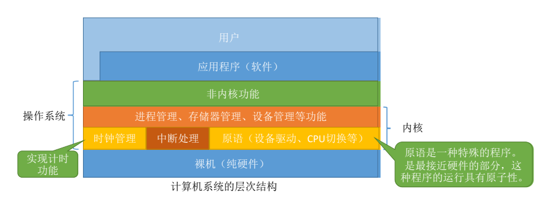


操作系统的功能：


# 二、内核态和用户态


<font color='blue'>**内核态与用户态？**</font>

* 核心态：**内核态是操作系统内核程序运行的状态**。cpu可以访问内存的所有数据，包括外围设备，例如硬盘，网卡。**内核态可执行特权指令与非特权指令**。

* 用户态：**是普通应用程序运行的状态**，只能受限的访问内存，且不允许访问外围设备。**用户态只能执行非特权指令。**


<font color='blue'>**为什么要有用户态和内核态？**</font>

* 为了限制不同的程序之间的访问能力, 防止他们获取别的程序的内存数据, 或者获取外围设备的数据, 并发送到网络, CPU划分出两个权限等级 -- 用户态和内核态


**<font color='blue' size='4'>用户态切换到内核态的几种方式？</font>**

- 系统调用: 系统调用是用户态主动要求切换到内核态的一种方式， 用户应用程序通过操作系统调用内核为上层应用程序开放的接口来执行程序。

  **操作系统为用户态运行的进程与硬件设备之间进行交互提供了一组接口，这组接口就是所谓的系统调用**

- 异常: 当CPU在执行运行在用户态下的程序时，发生了某些事先不可知的异常，这时会触发由当前运行进程切换到处理此异常的内核相关程序中，也就转到了内核态，比如缺页异常当cpu在执行用户态的应用程序时，发生了某些不可知的异常。 

- 外围设备的中断：发生中断，就意味着需要操作系统介入开展管理工作，cpu会立即进入核心态。

  比如：当硬件设备完成用户请求后，会向cpu发出相应的中断信号， 这时cpu会暂停执行下一条即将要执行的指令，转而去执行与中断信号对应的应用程序， 如果先前执行的指令是用户态下程序的指令，那么这个转换过程也是用户态到内核台的转换。


<font color='blue' size='4'>**系统调用和库函数的区别？**</font>

* 系统调用是操作系统向上层提供的接口。库函数用于提供用户态服务。它可能调用封装了一个或几个不同的系统调用（printf调用write），也可能直接提供用户态服务。
* 有些库函数涉及系统调用，有些不涉及（如取绝对值）


> **系统调用的分类：**
>
> 


# 三、进程

<font color='blue' size='4'>**进程是如何运行的？**</font>

* 每个进程都有自己的**进程控制块** (Process Control Block, PCB) 描述进程的基本信息和运行状态，所谓的创建进程和撤销进程，都是指对 PCB 的操作。 

* PCB是进程存在的唯一标志，当进程被创建时，操作系统为其创建PCB，当进程结束时，会回收其PCB。

  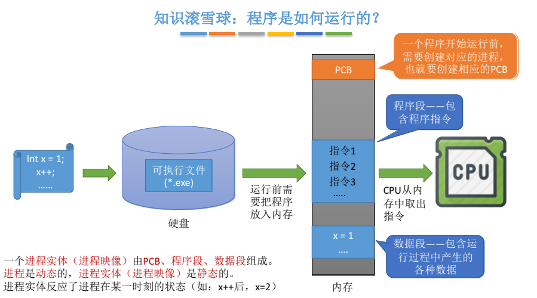

* **进程的组成：**

  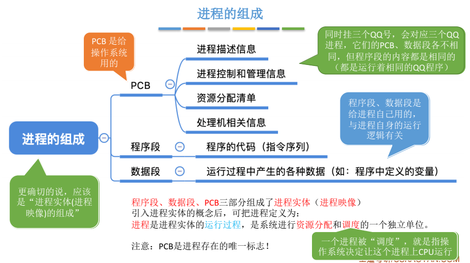


* **进程的五种状态：**

  

  

  


进程控制：

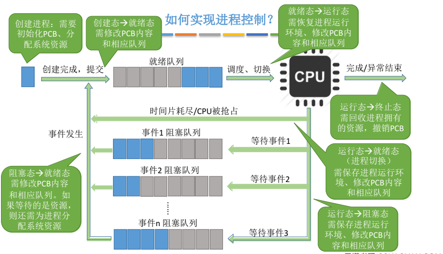


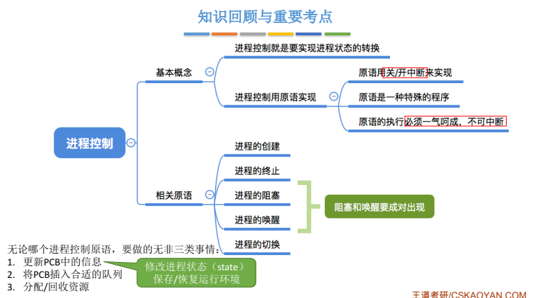


进程通信：

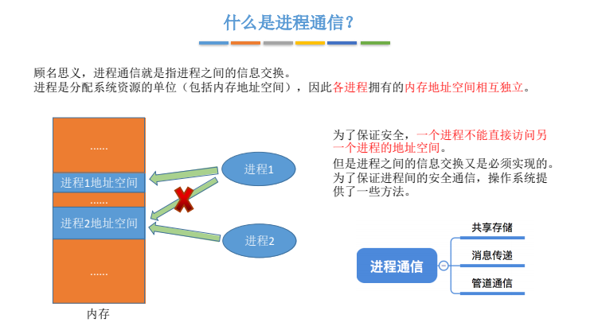

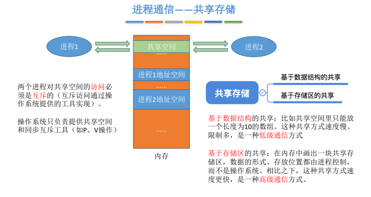

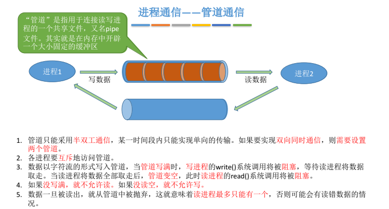


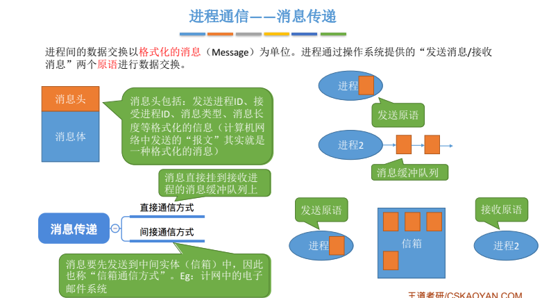

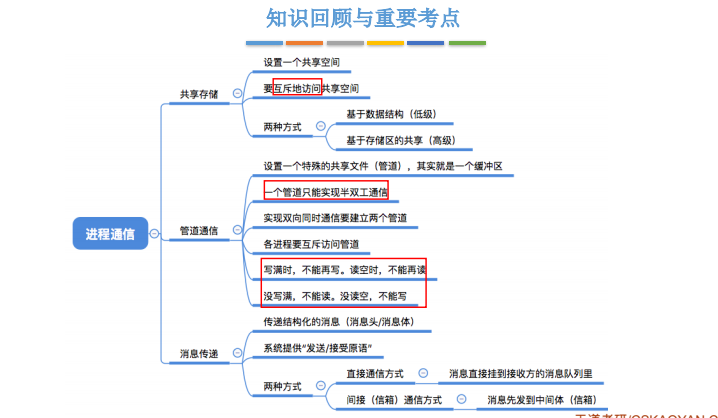


处理机的调度

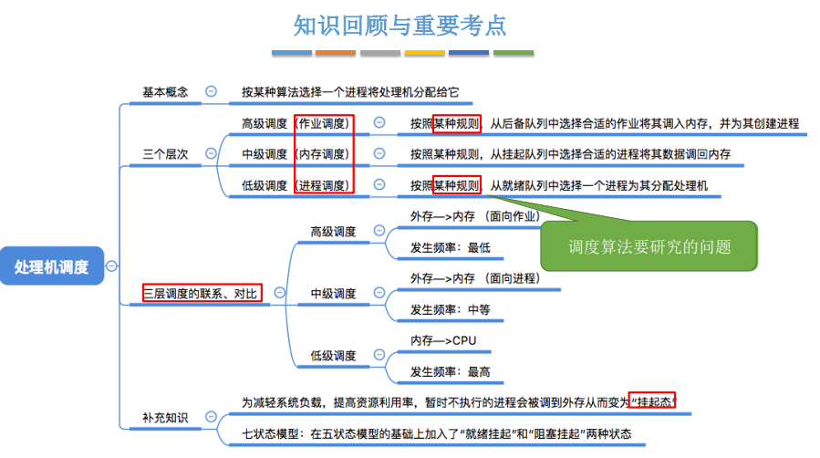


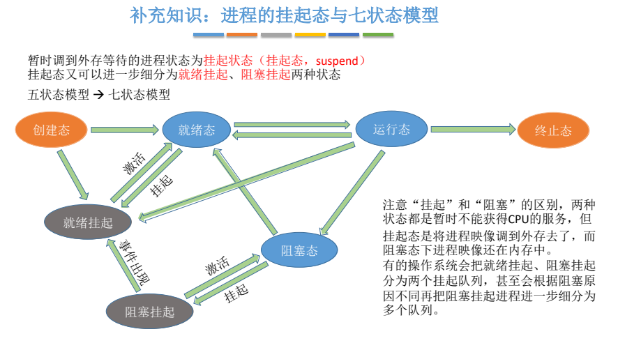


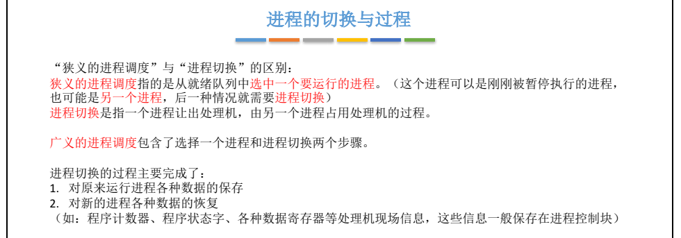


进程同步、进程互斥


进程同步：让各个并发进程按要求有序地推进


进程同步与互斥

互斥：指某一个资源同时只允许一个访问者对其进行访问，具有唯一性和排它性。但互斥无法限制访问者对资源的访问顺序，即访问是无序的
同步：是指在互斥的基础上（大多数情况下），通过其它机制实现访问者对资源的有序访问。大多数情况下，同步已经实现了互斥，特别是所有写入资源的情况必定是互斥的。少数情况是指可以允许多个访问者同时访问资源。
同步：体现的是一种协作性。互斥：体现的是排它性
————————————————
版权声明：本文为CSDN博主「AYJCSGM」的原创文章，遵循CC 4.0 BY-SA版权协议，转载请附上原文出处链接及本声明。
原文链接：https://blog.csdn.net/weixin_43664418/article/details/102092119


死锁的预防

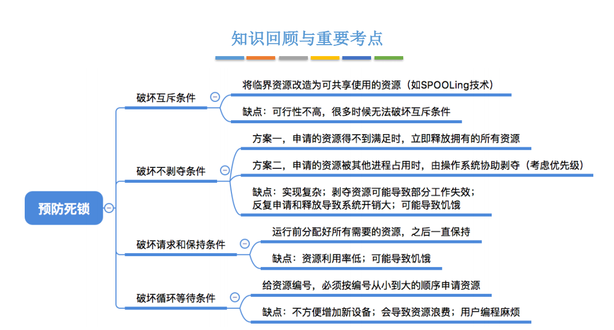


# 进程和线程的区别

[进程和线程的区别](https://blog.csdn.net/ThinkWon/article/details/102021274)

* **根本区别**：进程，程序的一次执行过程，是操作系统资源分配的基本单位，而线程是处理器任务调度和执行的基本单位

* **资源开销**：每个进程都有独立的内存单元 ，程序之间的切换会有较大的开销；线程可以看做轻量级的进程，同一类线程共享代码和数据空间，每个线程都有自己独立的运行栈和程序计数器（PC），线程之间切换的开销小。

  JVM中多个线程共享进程的**堆**和**方法区**资源，但每个线程有自己的**程序计数器**、**虚拟机栈**和**本地方法栈**，

* **包含关系**： 一个进程可以运行多个线程 ；线程是进程的一部分。


**并行和并发有什么区别？**

- 并行是指两个或者多个事件在同一时刻发生；而并发是指两个或多个事件在同一时间间隔发生。


# 进程间同步的方式


1. **信号量和PV操作**

   信号量（Semaphore）是一个整型变量，可以对其执行 down 和 up 操作，也就是常见的 P 和 V 操作。

   * **down** : 如果信号量大于 0 ，执行 -1 操作；如果信号量等于 0，进程睡眠，等待信号量大于 0；
   * **up** ：对信号量执行 +1 操作，唤醒睡眠的进程让其完成 down 操作。

   down 和 up 操作需要被设计成原语，不可分割

2. **管程**

   管程封装了同步操作， 所有进程都只能通过管程间接访问临界资源，而管程只允许一个进程进入并执行操作，从而实现进程互斥 。

 如果信号量的取值只能为 0 或者 1，那么就成为了 **互斥量（Mutex）** 


# 两个进程之间有哪些通信方式 

1. 管道通信
   * **匿名管道(Pipes)**：仅存在于内存中的临时对象，用于具有亲缘关系的父子进程间或者兄弟进程之间的通信。
   * **有名管道**：也是半双工的通信方式，但是它允许无亲缘关系进程间的通信 
   * 管道在内核中开辟一块缓冲区 ，允许进程以先进先出的方式写入和读出数据，并对读写操作进行同步。管道是一个**半双工通信**(可以选择方向的单向传输) ，即管道读写不能同时进行。

2. **共享内存**：
   * **使得多个进程可以可以直接读写同一块内存空间**，是最快的可用IPC形式。是针对其他通信机制运行效率较低而设计的。
   * 为了在多个进程间交换信息，内核专门留出了一块内存区，可以由需要访问的进程将其映射到自己的私有地址空间。进程就可以直接读写这一块内存而不需要进行数据的拷贝，从而大大提高效率。
   * 由于多个进程共享一段内存，因此需要**依靠某种同步机制**（如信号量）来达到进程间的同步及互斥。

3. **消息队列**：进程间的数据交换以格式化的消息（Message）为单位。进程通过操作系统提供的“发送消息/接收消息”两个原语进行数据交换。
   * **直接通信方式**：消息直接挂到接收进程的消息缓冲队列上
   * **间接通信方式**：消息要先发送到共享中间实体（信箱）的方式进行消息的放松和接收。
   
4. **套接字(Sockets)** : 此方法主要用于位于不同计算机的进程通过网络进行通信。套接字是支持 TCP/IP 的网络通信的基本操作单元。套接字主要包含3个参数，通信的目的IP地址、使用的传输层协议（TCP或UDP）和使用的端口号。

5. **信号(Signal)** ：信号是一种比较复杂的通信方式，用于通知接收进程某个事件已经发生；

6. **信号量(Semaphores)** ：信号量是一个计数器，用于多进程对共享数据的访问，信号量的意图在于进程间同步。这种通信方式主要用于解决与同步相关的问题并避免竞争条件。


## I/O模型


`网络IO的本质是socket的读取，socket在linux系统被抽象为流，IO可以理解为对流的操作`。刚才说了，对于一次IO访问（以read举例），`数据会先被拷贝到操作系统内核的缓冲区中，然后才会从操作系统内核的缓冲区拷贝到应用程序的地址空间`。所以说，当一个read操作发生时，它会经历两个阶段：

> 1. 第一阶段：等待数据准备 (Waiting for the data to be ready)。
> 2. 第二阶段：将数据从内核拷贝到进程中 (Copying the data from the kernel to the process)。

对于socket流而言，

> 1. 第一步：通常涉及等待网络上的数据分组到达，然后被复制到内核的某个缓冲区。
> 2. 第二步：把数据从内核缓冲区复制到应用进程缓冲区。

网络应用需要处理的无非就是两大类问题，`网络IO，数据计算`。相对于后者，网络IO的延迟，给应用带来的性能瓶颈大于后者。网络IO的模型大致有如下几种：


阻塞IO（bloking IO）

非阻塞IO（non-blocking IO）

多路复用IO（multiplexing IO）

信号驱动式IO（signal-driven IO）

异步IO（asynchronous IO）


## 2.1 同步阻塞 IO（blocking IO）

`同步阻塞 IO 模型是最常用的一个模型，也是最简单的模型`。在linux中，`默认情况下所有的socket都是blocking`。它符合人们最常见的思考逻辑。`阻塞就是进程 "被" 休息, CPU处理其它进程去了`。

在这个IO模型中，用户空间的应用程序执行一个系统调用（recvform），这会导致应用程序阻塞，什么也不干，直到数据准备好，并且将数据从内核复制到用户进程，最后进程再处理数据，`在等待数据到处理数据的两个阶段`，整个进程都被阻塞。不能处理别的网络IO。`调用应用程序处于一种不再消费 CPU 而只是简单等待响应的状态`。


当用户进程调用了recv()/recvfrom()这个系统调用，`kernel就开始了IO的第一个阶段：准备数据`（对于网络IO来说，很多时候数据在一开始还没有到达。比如，还没有收到一个完整的UDP包。这个时候kernel就要等待足够的数据到来）。这个过程需要等待，也就是说数据被拷贝到操作系统内核的缓冲区中是需要一个过程的。而在用户进程这边，整个进程会被阻塞（当然，是进程自己选择的阻塞）。`第二个阶段：当kernel一直等到数据准备好了，它就会将数据从kernel中拷贝到用户内存`，然后kernel返回结果，用户进程才解除block的状态，重新运行起来。

> 所以，blocking IO的特点就是在IO执行的两个阶段都被block了。

**优点：**

> 1. 能够及时返回数据，无延迟；
> 2. 对内核开发者来说这是省事了；

**缺点：**

> 1. 对用户来说处于等待就要付出性能的代价了；


## 2.2 同步非阻塞 IO（nonblocking IO）

`同步非阻塞就是 “每隔一会儿瞄一眼进度条” 的轮询（polling）方式`。在这种模型中，`设备是以非阻塞的形式打开的`。这意味着 IO 操作不会立即完成，read 操作可能会返回一个错误代码，说明这个命令不能立即满足（EAGAIN 或 EWOULDBLOCK）。

在网络IO时候，非阻塞IO也会进行recvform系统调用，检查数据是否准备好，与阻塞IO不一样，"非阻塞将大的整片时间的阻塞分成N多的小的阻塞, 所以进程不断地有机会 '被' CPU光顾"。

`也就是说非阻塞的recvform系统调用调用之后，进程并没有被阻塞，内核马上返回给进程，如果数据还没准备好，此时会返回一个error`。进程在返回之后，可以干点别的事情，然后再发起recvform系统调用。重复上面的过程，循环往复的进行recvform系统调用。`这个过程通常被称之为轮询`。轮询检查内核数据，直到数据准备好，再拷贝数据到进程，进行数据处理。**`需要注意，拷贝数据整个过程，进程仍然是属于阻塞的状态`**。

在linux下，可以通过设置socket使其变为non-blocking。`当对一个non-blocking socket执行读操作时`，流程如图所示：


当用户进程发出read操作时，如果kernel中的数据还没有准备好，那么它并不会block用户进程，而是立刻返回一个error。从用户进程角度讲，它发起一个read操作后，并不需要等待，而是马上就得到了一个结果。用户进程判断结果是一个error时，它就知道数据还没有准备好，于是它可以再次发送read操作。一旦kernel中的数据准备好了，并且又再次收到了用户进程的system call，那么它马上就将数据拷贝到了用户内存，然后返回。

> 所以，nonblocking IO的特点是用户进程需要不断的主动询问kernel数据好了没有。

**同步非阻塞方式相比同步阻塞方式：**

> 优点：能够在等待任务完成的时间里干其他活了（包括提交其他任务，也就是 “后台” 可以有多个任务在同时执行）。
>
> 缺点：任务完成的响应延迟增大了，因为每过一段时间才去轮询一次read操作，而任务可能在两次轮询之间的任意时间完成。这会导致整体数据吞吐量的降低。

## 2.3 IO 多路复用（ IO multiplexing）

由于同步非阻塞方式需要不断主动轮询，轮询占据了很大一部分过程，轮询会消耗大量的CPU时间，而 “后台” 可能有多个任务在同时进行，人们就想到了循环查询多个任务的完成状态，只要有任何一个任务完成，就去处理它。如果轮询不是进程的用户态，而是有人帮忙就好了。`那么这就是所谓的 “IO 多路复用”`。UNIX/Linux 下的 select、poll、epoll 就是干这个的（epoll 比 poll、select效率高，做的事情是一样的）。

`IO多路复用有两个特别的系统调用select、poll、epoll函数`。select 调用是内核级别的，select 轮询相对非阻塞的轮询的区别在于---`前者可以等待多个socket，能实现同时对多个IO端口进行监听`，当其中任何一个socket 的数据准好了，`就能返回进行可读`，`然后进程再进行recvform系统调用，将数据由内核拷贝到用户进程，当然这个过程是阻塞的`。select或poll调用之后，会阻塞进程，与blocking IO阻塞不同在于，`此时的select不是等到socket数据全部到达再处理, 而是有了一部分数据就会调用用户进程来处理`。如何知道有一部分数据到达了呢？`监视的事情交给了内核，内核负责数据到达的处理。也可以理解为"非阻塞"吧`。

`I/O复用模型会用到select、poll、epoll函数，这几个函数也会使进程阻塞，但是和阻塞I/O所不同的的，这两个函数可以同时阻塞多个I/O操作`。而且**可以同时对多个读操作，多个写操作的I/O函数进行检测，直到有数据可读或可写时（注意不是全部数据可读或可写），才真正调用I/O操作函数**。

对于多路复用，也就是轮询多个socket。`多路复用既然可以处理多个IO，也就带来了新的问题，多个IO之间的顺序变得不确定了`，当然也可以针对不同的编号。具体流程，如下图所示：


IO multiplexing就是我们说的select，poll，epoll，有些地方也称这种IO方式为event driven IO。`select/epoll的好处就在于单个process就可以同时处理多个网络连接的IO`。它的基本原理就是select，poll，epoll这个function会不断的轮询所负责的所有socket，当某个socket有数据到达了，就通知用户进程。

`当用户进程调用了select，那么整个进程会被block`，而同时，kernel会“监视”所有select负责的socket，`当任何一个socket中的数据准备好了，select就会返回`。这个时候用户进程再调用read操作，将数据从kernel拷贝到用户进程。


## 2.4 信号驱动式IO（signal-driven IO）

信号驱动式I/O：首先我们允许Socket进行信号驱动IO,并安装一个信号处理函数，进程继续运行并不阻塞。当数据准备好时，进程会收到一个SIGIO信号，可以在信号处理函数中调用I/O操作函数处理数据。过程如下图所示：


## 2.5 异步非阻塞 IO（asynchronous IO）

相对于同步IO，异步IO不是顺序执行。`用户进程进行aio_read系统调用之后，无论内核数据是否准备好，都会直接返回给用户进程，然后用户态进程可以去做别的事情`。等到socket数据准备好了，内核直接复制数据给进程，`然后从内核向进程发送通知`。`IO两个阶段，进程都是非阻塞的`。

Linux提供了AIO库函数实现异步，但是用的很少。目前有很多开源的异步IO库，例如libevent、libev、libuv。异步过程如下图所示：


用户进程发起aio_read操作之后，立刻就可以开始去做其它的事。而另一方面，从kernel的角度，当它受到一个asynchronous read之后，`首先它会立刻返回，所以不会对用户进程产生任何block`。然后，kernel会等待数据准备完成，然后将数据拷贝到用户内存，`当这一切都完成之后，kernel会给用户进程发送一个signal或执行一个基于线程的回调函数来完成这次 IO 处理过程`，告诉它read操作完成了。


# 进程的调度算法

- **先到先服务(FCFS)调度算法** : 按照进程**到达的先后顺序进行调度**。从就绪队列中选择一个最先进入该队列的进程为之分配资源，使它立即执行并一直执行到完成或发生某事件而被阻塞放弃占用 CPU 时再重新调度。

* **短作业/进程优先调度算法（SPF, Shortest Process First）**：每次调度时选择当前**已到达且运行时间最短**的进程。

* **最短剩余时间优先算法**：每当有进程加入就绪队列改变时就需要调度，如果**新到达的进程剩余时间比当前运行的进程剩余时间更短，则由新进程抢占处理机**，当前运行进程重新回到就绪队列。另外，当一个进程完成时也需要调度。
* **高响应比优先算法**：非抢占式的调度算法。在每次调度时先计算各个作业/进程的响应比，选择响应比最高的作业/进程为其服务
  * 响应比计算：（等待时间+要求服务时间）/要求服务时间
* **时间片轮转调度算法**：RR(Round robin)调度。**轮流让就绪队列中的进程依次执行一个时间片**（每次选择的都是排在就绪队列队头的进程）。时间片轮转调度是一种最古老，最简单，最公平且使用最广的算法。
* **优先级调度算法：**
  * 非抢占式的优先级调度算法：每次调度时选择当前已到达且优先级最高的进程。当前**进程主动放弃处理机时发生调度。**
  * 抢占式的优先级调度算法：每次调度时选择当前已到达且优先级最高的进程。当前进程主动放弃处理机时发生调度。另外，**当就绪队列发生改变时也需要检查是会发生抢占。**

- **多级反馈队列调度算法** ：

  1. **设置多级就绪队列，各级队列优先级从高到低，时间片从小到大**

  2. 新进程到达时先进入第1级队列，按FCFS原则排队等待被分配时间片，**若用完时间片进程还未结束，则进程进入下一级队列队尾**。如果此时已经是在最下级的队列，则重新放回该队列队尾
  3. **只有第 k 级队列为空时，才会为 k+1 级队头的进程分配时间片**


# 内存管理的作用

1. 负责**内存空间的分配与回收**
2. 需要提供某种技术从逻辑上**对内存空间进行扩充**
3. 提供**地址转换功能**，负责程序的逻辑地址与物理地址的转换
4. 提供**内存保护**功能。保证各进程在各自存储空间内运行，互不干扰

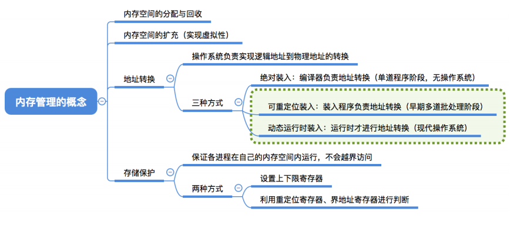

## 内存空间的分配与回收

内存空间的分配与回收主要有两种方式：**连续分配管理方式**和**非连续分配管理方式**。

* **连续分配管理方式**

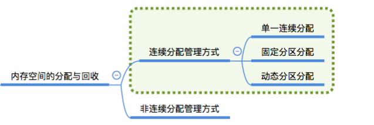

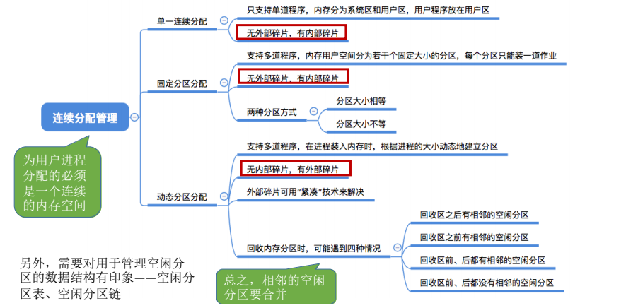

* **非连续分配管理方式**
  * 分页存储管理
  * 分段存储管理
  * 段页式管理


## 分页存储管理和分段存储管理

分页存储管理和分段存储管理是操作系统内存分配与回收的两种常见方式。

* **分页存储管理：**

  把**内存空间分成一个个大小相等的分区，称为“页框”**（页框=内存块=物理块）。相应的，进**程的地址空间被划分成若干固定大小的区域，称为“页或页面”**，页和页框的大小相等。可将进程的任一页放在内存的任一块中，实现了离散分配。 

  **页表**：为了能知道进程的每个页面在内存中存放的位置，操作系统要为每个进程建立一张页表。页表的作用是**实现从页号到物理块号的地址映射**。注：页表通常存在PCB（进程控制块）中。 

* **分段存储管理：**

  **将用户程序地址空间分成若干个大小不等的段，每段可以定义一组相对完整的逻辑信息**。存储分配时，**以段为单位**，段与段在内存中可以不相邻接，也实现了离散分配。  段式管理通过段表对应逻辑地址和物理地址。

* **段页式存储管理：**

  在段页式存储管理系统中，**进程的地址空间首先被分成若干个逻辑分段**，每段都有自己的段号，**然后再将每段分成若干个大小相等的页**。对于主存空间也分成大小相等的页，主存的分配以页为单位。

  为实现段页式存储管理，系统应为**每个进程设置一个段表**，包括每段的段号，该段的页表始址和页表长度。**每个段有自己的页表，记录段中的每一页的页号和存放在主存中的物理块号**。 


**分页机制和分段机制的对比：**

* 页是信息的物理单位。分页的主要目的是为了实现离散分配，提高内存利用率。分页仅仅是系统管理上的需要，完全是系统行为，对用户是不可见的。
* 段是信息的逻辑单位。分段的主要目的是更好地满足用户需求。一个段通常包含着一组属于一个逻辑模块的信息。分段对用户是可见的，用户编程时需要显式地给出段名。
* 页的大小固定且由系统决定。段的长度却不固定，决定于用户编写的程序。
* 分页的用户进程地址空间是**一维**的，程序员只需给出一个记忆符即可表示一个地址。分段的用户进程地址空间是**二维**的，程序员在标识一个地址时，既要给出段名，也要给出段内地址。

* 分页管理 内存空间利用率高，**不会产生外部碎片，只会有少量的页内碎片**；而段式管理**会产生外部碎片**。

## 快表和多级页表

* **快表：**

  为了**解决虚拟地址到物理地址的转换速度**，操作系统在 **页表方案** 基础之上引入了 **快表** 来加速虚拟地址到物理地址的转换。**快表**，又称联想寄存器（TLB，translation lookaside buffer），是一种访问速度比内存快很多的高速缓存（TLB不是内存！），用来存放最近访问的页表项的副本，可以加速地址变换的速度。由于采用页表做地址转换，读写内存数据时 CPU 要访问两次主存。有了快表，有时只要访问一次高速缓冲存储器，一次主存，这样可加速查找并提高指令执行速度。

  使用快表之后的地址转换流程是这样的：

  1. 根据虚拟地址中的页号查快表；
  2. 如果该页在快表中，直接从快表中读取相应的物理地址；
  3. 如果该页不在快表中，就访问内存中的页表，再从页表中得到物理地址，同时将页表中的该映射表项添加到快表中；
  4. 当快表填满后，又要登记新页时，就按照一定的淘汰策略淘汰掉快表中的一个页。

* 多级页表：

  单级页表的两个问题：

  * 问题一：页表必须连续存放，因此当页表很大时，需要占用很多个连续的页框。
  * 问题二：没有必要让整个页表常驻内存，因为进程在一段时间内可能只需要访问某几个特定的页面

  **多级页表**：把页表再分页并离散存储，然后**再建立一张页表记录页表各个部分的存放位置**。

## 内部碎片和外部碎片

 [](https://img2018.cnblogs.com/blog/1542615/202002/1542615-20200210175541985-1673798954.png)

- **内部碎片：**已经被分配出去（能明确指出属于哪个进程）却不能被利用的内存空间；

  > **内部碎片**是处于（操作系统分配的用于装载某一进程的内存）区域内部或页面内部的存储块。
  >  占有这些区域或页面的进程**并不使用这个存储块**。
  >  而在进程占有这块存储块时，**系统无法利用它**。
  >  直到进程释放它，或进程结束时，系统才有可能利用这个存储块。

- **外部碎片：**还没有被分配出去（不属于任何进程），但由于太小了无法分配给申请内存空间的新进程的内存空闲区域。

  > **外部碎片**是处于任何两个已分配区域或页面之间的空闲存储块。
  >  这些存储块的总和可以满足当前申请的长度要求，但是由于它们的地址不连续或其他原因，使得系统无法满足当前申请。


# 虚拟内存

**局部性原理是什么？**

-  时间上的局限性：最近被访问的页在不久的将来还会被访问
- 空间上的局限性：内存中被访问的页周围的页很可能被访问


**什么是虚拟内存？**

**虚拟内存可以让程序拥有超过系统实际物理内存大小的可用内存空间** 。基于局部性原理，在程序装入时，可以将程序的一部分装入内存，而将其他部分留在外存，就可以启动程序执行。在程序执行过程中，当所访问的信息不在内存时，由操作系统将所需要的部分调入内存，然后继续执行程序。另一方面，操作系统将内存中暂时不使用的内容换到外存上，从而腾出空间存放将要调入内存的信息。这样，计算机好像为用户提供了一个比实际内存大的多的内存——**虚拟内存**。 


## 虚拟内存技术的实现？

**虚拟内存的实现需要建立在离散分配的内存管理方式的基础上。** 虚拟内存的实现有以下三种方式：

1. **请求分页存储管理** ：建立在分页管理之上，为了支持虚拟存储器功能而增加了**请求调页功能**和**页面置换功能**。请求分页是目前最常用的一种实现虚拟存储器的方法。请求分页存储管理系统中，在作业开始运行之前，仅装入当前要执行的部分段即可运行。假如在作业运行的过程中发现要访问的页面不在内存，则由处理器通知操作系统按照对应的页面置换算法将相应的页面调入到主存，同时操作系统也可以将暂时不用的页面置换到外存中。
2. **请求分段存储管理** ：建立在分段存储管理之上，增加了请求调段功能、分段置换功能。请求分段储存管理方式就如同请求分页储存管理方式一样，在作业开始运行之前，仅装入当前要执行的部分段即可运行；在执行过程中，可使用请求调入中断动态装入要访问但又不在内存的程序段；当内存空间已满，而又需要装入新的段时，根据置换功能适当调出某个段，以便腾出空间而装入新的段。
3. **请求段页式存储管理**


## 页面置换算法

地址映射过程中，若在页面中发现所要访问的页面不在内存中，则发生缺页中断 。

当发生缺页中断时，如果当前内存中并没有空闲的页面，操作系统就必须在内存选择一个页面将其移出内存，以便为即将调入的页面让出空间。用来选择淘汰哪一页的规则叫做页面置换算法，我们可以把页面置换算法看成是淘汰页面的规则。

- **OPT 页面置换算法（最佳页面置换算法）** ：最佳(Optimal, OPT)置换算法所选择的被淘汰页面将是以后永不使用的，或者是在最长时间内不再被访问的页面,这样可以保证获得最低的缺页率。（但由于人们目前无法预知进程在内存下的若千页面中哪个是未来最长时间内不再被访问的，因而该算法无法实现）
- **FIFO（First In First Out） 页面置换算法（先进先出页面置换算法）** : 总是淘汰最先进入内存的页面，即选择在内存中驻留时间最久的页面进行淘汰。
- **LRU （Least Currently Used）页面置换算法（最近最久未使用页面置换算法）** ：每次淘汰的页面是最近最久未使用的页面。LRU算法赋予每个页面一个访问字段，用来记录一个页面自上次被访问以来所经历的时间 T，当须淘汰一个页面时，选择现有页面中其 T 值最大的，即最近最久未使用的页面予以淘汰。
- **LFU （Least Frequently Used）页面置换算法（最少使用页面置换算法）** : 该置换算法选择在之前时期使用最少的页面作为淘汰页。
- **时钟置换算法（CLOCK）**：时钟算法使用环形链表将页面连接起来，再使用一个指针指向最老的页面。它将整个环形链表的每一个页面做一个标记，如果标记是1，那么暂时就不会被替换，然后时钟算法遍历整个环，遇到标记为0的就替换，否则将标记为1的标记为0。 

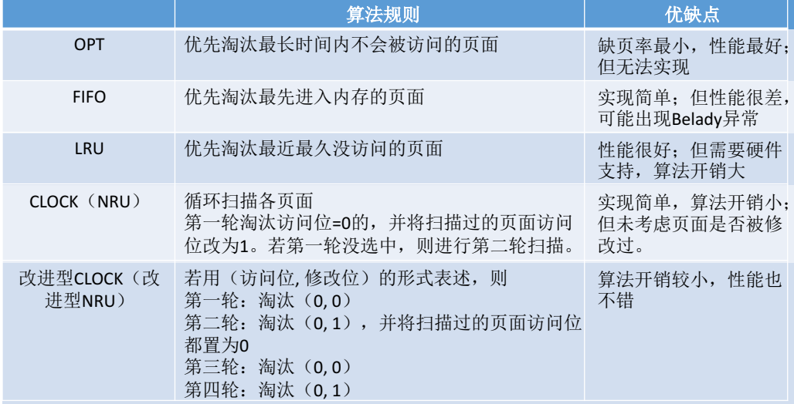


# 磁盘调度算法

* **先来先服务（FCFS）算法**

  **FCFS算法根据进程请求访问磁盘的先后顺序进行调度处理**。这是一种最简单的调度算法。这种算法的优点是具有公平性。如果只有少量进程需要访问，且大部分请求都是访问簇聚的文件扇区，则会达到较好的性能；但如果有大量进程竞争使用磁盘，那么这种算法在性能上往往低于随即调度。所以，实际磁盘调度中考虑一些更为复杂的调度算法。

* **最短寻找时间优先（SSTF）算法**

  SSTF 算法会**优先处理的磁道是与当前磁头最近的磁道**。可以保证每次的寻道时间最短，但是并不能保证总的寻道时间最短。但是能提供比FCFS算法更好的性能。这种算法会产生饥饿现象。

* **扫描（SCAN）算法又称为电梯算法**

  **在SSTF基础上规定，只有磁头移动到最外侧磁道的时候才能往内移动，移动到最内侧磁道的时候才能往外移动。**由于磁头移动规律与电梯运行相似，故又称为电梯调度算法。SCAN算法对最扫描过的区域不公平，因此，他在访问局部性方面不如FCFS算法和SSTF算法好。

* **循环扫描（C-SCAN）算法**

  在SCAN算法基础上，规定只有磁头朝某个特定方向移动时才处理磁道访问请求，而返**回时直接快速移动至起始端而不处理任何请求**。


# Linux相关


## 操作系统的目标与作用

### 基本概念

操作系统是指控制和管理整个计算机系统的硬件和软件资源，并合理地组织调度计算机的工作和资源的分配，以提供给用户和其他软件方便的接口和环境的程序集合。

### 操作系统的目标

不同的操作系统，其目标的侧重点不相同。不过一般来说，可以分为以下几点

（1）有效性。

- 提高系统资源利用率。
- 提高系统的吞吐量。

（2）方便性。因为配置了操作系统的可以使我们的计算机更容易被使用。

（3）可扩充性。方便增加新的功能和模块，并能修改老的功能和模块。

（4）开放性。开放性是指系统能遵循世界标准规范，特别是遵循开放系统互连（OSI）国际标准。

### 操作系统的作用

（1）OS作为用户与计算机硬件系统之间的接口。常用的三种使用方式如下：

- 命令方式
- 系统调用方式
- 图形、窗口方式。

[](https://img2020.cnblogs.com/blog/1993240/202009/1993240-20200917103119831-671386259.png)

（2）OS作为计算机系统资源的管理者。

- 处理机管理。用于分配和控制处理机
- 存储器管理。主要负责内存的分配和回收
- I/O设备管理。负责I/O设备的分配和操纵
- 文件管理。负责文件的存取、共享和保护

（3）OS实现了对计算机资源的抽象。对用户提供了一个对硬件操作的抽象模型，隐藏了那些不友好的交互操作。（用户只需要这些IO操作命令它来进行数据输入或输出，而无需关心 I/O 是如何实现的）

[](https://img2020.cnblogs.com/blog/1993240/202009/1993240-20200917103547331-1385247103.png)

### 操作系统的发展动力

（1）不断提高计算机资源的利用率。

（2）方便用户。

（3）器件的不断更新换代。

（4）计算机体系结构的不断发展。

## 操作系统的发展过程

### 手工操作阶段

**（1）人工操作方式**

程序员将对应于程序和数据的已穿孔的纸带(或卡片)装入输入机，然后启动输入机把程序和数据输入计算机内存。

缺点：

1. 用户独占全机。计算机及其全部资源只能由上机用户独占。
2. CPU等待人工操作。大大降低了计算机资源的利用率（当用户进行装带(卡)、卸带(卡)等人工操作时，CPU 及内存等资源是空闲的。）。

**（2）脱机输入/输出方式**

目的是为了解决人机矛盾及CPU和I/O设备之间速度不匹配的矛盾。主要是利用机器来解决人工操作慢的过程。

优点：

1. 减少了CPU的空闲时间。
2. 提高了IO速度。

### 单道批处理系统

单道批处理系统主要是把一批作业以脱机方式输入到磁带上，并在系统中配上监督程序，在它的控制下使这这批作业能一个接一个地连续处理。

**特征**

（1）自动性。在磁带上的作业自动地逐个地依次运行，而无需人工干预。

（2）顺序性。磁带上的各道作业是顺序进入内存中。

（3）单道性。内存中仅有一道程序运行，即监督程序每次从磁带上只调入一道程序进入内存运行。

**优缺点**

优点：引入批处理一定程度缓解了人机速度矛盾。

缺点：内存仅有一道作业运行，运行结束才调入下一道程序，CPU大量时间在等待IO完成，资源利用率依然很低。

### 多道批处理系统

**概念**

所谓多道批处理就是将用户所提交的作业都优先存放的外存上并排成一个队列（“后备队列”），然后由作业调度程序按一定的算法从后备队列中选择若干个作业调入内存，使它们共享CPU和系统中的各种资源。

**引入的好处**

（1）提高CPU的利用率。

（2）可提高内存和I/O设备利用率。

（3）增加系统吞吐量。

**优缺点**

优点：1、资源利用率高；2、系统吞吐量大。

缺点：1、平均周转时间长；2、无交互能力。

**需要解决的问题**

（1）处理机管理问题；（2）内存管理问题；（3）I/O设备管理问题；（4）文件管理问题；（5）作业管理问题。

### 分时系统

分时系统是指在一台主机上连接了多个带有显示器和键盘的终端，同时允许多个用户通过自己的终端，以交互方式（时间片轮转）使用计算机，共享主机中的资源。

**特征**

（1）多路性。宏观上，是多个用户同时工作，共享系统资源；而微观上，则是每个用户作业轮流运行一个时间片。多路性即同时性，它提高了资源利用率，降低了使用费用，从而促进了计算机更广泛的应用。

（2）独立性。每个用户各占一个终端，彼此独立操作，互不干扰。

（3）及时性。用户可以在很短的时间内获得响应。

（4）交互性。用户可以请求系统提供多方面的服务，如文件编辑，数据处理和资源共享等。

**缺点**：因为不能实时处理一些信息引入实时系统。

### 实时系统

实时系统是指系统能及时响应外部事件的请求，在规定的时间内完成对该事件的处理，并控制所有实时任务协调一致地运行。

**实时与分时的特征比较**

（1）多路性。实时控制系统的多路性则主要表现在系统周期性地对多路现场信息进行采集，以及对多个对象或多个执行机构进行控制。

（2）独立性。实时控制系统中，对信息的采集和对对象的控制也都是彼此互不干扰。

（3）及时性。等待的时间都是 人所能接收的。

（4）交互性。实时系统的交互仅限于访问系统中某些特定的专用服务程序。

（5）可靠性。要求系统具有高度的可靠性，采取了多级容错措施来保障系统的安全性以及数据的安全性。

### 其他系统

**网络操作系统**

各台计算机结合实现网络中各种资源共享通信

**分布式操作系统**

通信交换数据、同等低位、资源共享、构成子系统、任务可分布在多个计算机并行工作协同完成。

特征：（1）分布性；（2）并行性。

## 操作系统的基本特性⭐

### 并发性

**并行与并发**

我们一定要切记不要搞混了并发与并行这两个不同的概念：并行性市值两个或多个事件在同一时刻发生；而并发性是指两个或多个事件在同一时间间隔内发生。

（1）并行需要硬件支持，如多流水线、多核处理器或者分布式计算系统。

（2）而并发则是操作系统通过引入进程和线程才能去实现的。`进程是指在操作系统中能独立运行并作为资源分配的基本单位。而线程则是独立运行和独立调度的基本单位。`

### 共享性

所谓共享是指系统中的资源可供内存中多个并发执行的进程或者线程共同使用。而把这种资源共同使用则称为资源共享或者资源复用。

目前主要实现资源共享的方式有如下两种。

**（1）互斥共享方式**

一般来说，我们把一个进程访问完并释放该资源后，才允许另一进程对该资源进行访问的这种资源共享方式称为互斥式共享。而把在一段时间内只允许一个进程访问的资源称为临界资源或独占资源。

**（2）同时访问方式**

操作系统还有另一类资源可以由多个进程同时对它们进行访问。这里的同时指的是交替地对该资源进行访问。典型的资源就是我们的“磁盘设备”。

```
并发和共享是操作系统的两个最基本的特征，它们又是互为存在的条件。
```

### 虚拟技术

所谓的虚拟技术就是指通过某种技术把一个物理实体变为若干个逻辑上的对应物。在操作系统上利用了两种方式实现虚拟技术，即时分复用技术和空分复用技术。

**时分复用技术**

多个进程能在同一个处理器上并发执行使用了时分复用技术，让每个进程轮流占用处理器，每次只执行一小个时间片并快速切换。

**空分复用技术**

虚拟内存使用了空分复用技术，它将物理内存抽象为地址空间，每个进程都有各自的地址空间。地址空间的页被映射到物理内存，地址空间的页并不需要全部在物理内存中，当使用到一个没有在物理内存的页时，执行页面置换算法，将该页置换到内存中。（同样的还有虚拟磁盘和虚拟存储器技术）

### 异步性

多个程序并发执行，资源有限，执行不是一贯到底，而是走走停停（争抢到资源和CPU才执行）

## 操作系统的主要功能⭐

### 处理机管理功能

处理机管理的主要功能是创建和撤销进程（线程），对诸进程（线程）的运行进行协调，实现进程（线程）之间的信息交换，以及按照一定的算法把处理机分配给进程（线程）。具体的功能如下：

（1）进程控制。主要是为了作业创建进程，撤销已经结束的进程，以及控制进程在运行过程中的状态转换。现在还多了一个为进程创建多个线程和撤销已经完成任务的线程的功能。

（2）进程同步。进程同步的主要任务是为多个进程（包括线程）的运行进行协调。主要包括两种方式：进程互斥方式和进程同步方式。具体在后面篇幅会具体整理到相关知识点。

（3）进程通信。主要任务就是用来实现在相互合作的进程之间的信息交换。

（4）调度。主要分为作业调度和进程调度。作业调度的基本任务是从后备队列中按照一定的算法，选择出若干个作业，为它们分配运行所需的资源(首先是分配内存)。进程调度的任务是从进程的就绪队列中，按照一定的算法选出一个进程，把处理机分配给它，并为它设置运行现场，使进程投入执行。

### 存储器管理功能

储器管理的主要任务是为多道程序的运行提供良好的环境，方便用户使用存储器，提高存储器的利用率以及能从逻辑上扩充内存。存储器管理应具有内存分配、内存保护、地址映射和内存扩充等功能。

（1）**内存分配。**内存分配主要就是为每道程序分配内存空间，提高存储器的利用率。同时也允许动态增加内存的需求（允许正在运行的程序申请附加的内存空间）。为了实现内存分配，在机制中应具有这样的结构的功能：1、内存分配数据结构；2、内存分配功能；3、内存回收功能。

（2）**内存保护。**内存保护的主要任务是确保每道用户程序都只在自己的内存空间内运行，彼此互不干扰。一个简单的的内存保护机制就是设置两个界限寄存器。

（3）**地址映射。**存储器管理必须提供地址映射功能，以将地址空间中的逻辑地址转换为内存空间中与之对应的物理地址。

（4）**内存扩充。**从逻辑上去扩充内存容量，让用户感受到的内存容量比实际内存容量大得多。系统必须具有内存扩充机制，用于实现请求调入功能和置换功能。

### 设备管理功能

完成用户的 I/O 请求，方便用户使用各种设备，并提高设备的利用率。主要包括缓冲管理、设备分配、设备处理、虛拟设备等。

### 文件管理功能

文件管理的主要任务是对用户文件和系统文件进行管理，以方便用户使用，并保证文件的安全性。为此，文件管理应具有对文件存储空间的管理、目录管理、文件的读/写管理，以及文件的共享与保护等功能。

### 系统与用户的接口

(1) 用户接口。它是提供给用户使用的接口，用户可通过该接口取得操作系统的服务。
(2) 程序接口。它是提供给程序员在编程时使用的接口，是用户程序取得操作系统服务
的惟一途径。

## 操作系统的体系结构⭐

**大内核：** 大内核是将操作系统主要功能模块都作为一个紧密结合的整体运行在核心态，具有很高的性能。

**微内核：** 由于操作系统不断复杂，因此将一部分操作系统功能移出内核，从而降低内核的复杂性。移出的部分根据分层的原则划分成若干服务，相互独立。在微内核结构下，操作系统被划分成小的、定义良好的模块，只有微内核这一个模块运行在内核态，其余模块运行在用户态。因为需要频繁地在用户态和核心态之间进行切换，所以会有一定的性能损失。


进程的通信

锁的概念

ISO7层模型，4层模型


 上下文切换 --用户态和内核态 


· 怎么看进程使用情况--top命令详解 


1. 线程和进程的区别？ 
2. 虚拟内存是什么概念？为什么需要虚拟内存（虚拟内存的优势）？MMU？页面置换[算法]()？ 

OSI 的7层网络模型 


1. 操作系统的IO模型有多少种？可以具体介绍一下吗     
2. 操作系统的内存管理 
3. CPU指令和中断 

、进程与线程的区别 

2、 操作系统中的堆栈都是干什么的 

3、操作系统中的物理内存与虚拟内存（疫情上的网课，OS压根就没学） 

4、信号量是干什么的 

·     虚拟内存有什么用？ 

LRU 

段式管理和页式管理是什么 

· 有哪些常见的内存置换[算法]()，分别解释一下 


· 死锁是什么 

1. 什么[算法]()可以避免死锁 

2. 1. 银行家[算法]()是怎么实现的 
   2. 除了银行家[算法]()有没有其它的可以避免死锁的方法 

进程，线程通信机制

你是如何理解操作系统的

你对于操作系统的进程和线程、子进程是如何理解的

- 进程间通信的方式有哪些？基本原理？ 

- - 管道/匿名管道：      
  - 有名管道： 
  - 信号 
  - 消息队列 
  - 信号量 
  - 共享内存 
  - 套接字 

- 进程调度[算法]()有哪些？ 

- 死锁： 

- - 什么是死锁？死锁产生的原因？死锁产生的必要条件？（互斥、不可剥夺、请求与保持、循环等待）      
  - 死锁的处理基本策略和常用方法？ 

- 页面置换[算法]()有哪些？ 

死锁的条件

 

从破坏死锁必要条件答如何避免死锁

28.手写个生产者消费者模型？（不会）

1.进程和线程?

 

2.

3.你平时用线程怎么用的？

5.说一下线程如何执行任务的吧